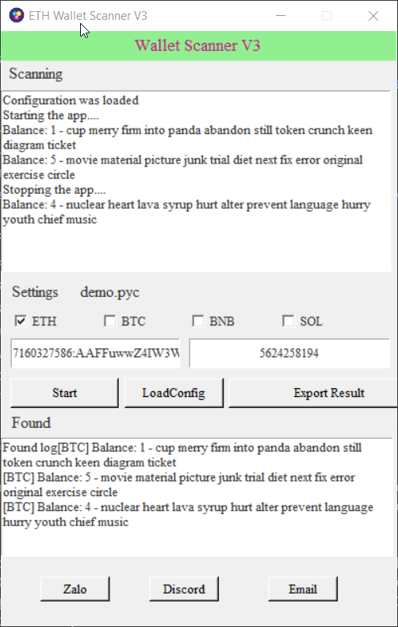

<div align='center'>
<h1>Bruteforcing forgotten wallet using seed phrases</h1>
</div>
<p align="center">

</p>

## :star2: About the Project
This project aim to find the forgotten wallet using mnemonic generator (12 words).

It provide you a GUI and a kind of worker thread for you.

It also provide the ability to plugin your finder (coinspecific routine)

### :gear: Getting Started
1. Clone this repo
2. Install the requirements in requirements.txt
```bash
pip install -r requirements.txt
```
4. Build the coinspecific using util.py and find the pyc in the coinspecific folder
```bash
python util.py
```
5. Start the gui
```bash
python gui.py
```
6. In the gui, you can make basic config but you can edit config directly in: config.json
7. Enjoy!

### :running: Todo
- Add more coin
- Run without gui

### 💬 Credit

<p align="left">
<a href="https://fb.com/wolfxforce" target="blank"></a> &nbsp;
  <a href="https://fb.com/wolfxforce" target="blank"></a>
</p>

### Screenshot
<p align="left">

</p>
